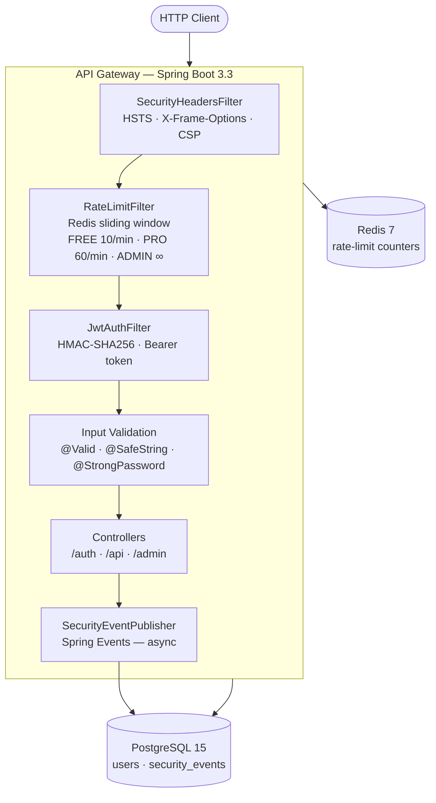

# Secure API Gateway

[](https://github.com/pabloncf/secure-api-gateway/actions/workflows/ci.yml)
[](https://github.com/pabloncf/secure-api-gateway/actions)
[](https://openjdk.org/projects/jdk/17/)
[](https://spring.io/projects/spring-boot)
[](https://docs.docker.com/compose/)

A production-grade API Gateway built to demonstrate security engineering depth: JWT authentication, per-tier rate limiting with Redis, input sanitization, structured security event logging, and a metrics dashboard.

Built as a portfolio project targeting Berlin engineering roles.

---

## Architecture



Every inbound request traverses the filter chain left to right. A request blocked at any layer (rate limit exceeded, bad token, malicious payload) is rejected before reaching the controllers and logged as a security event.

---

## Security Decisions

### Why JWT instead of server-side sessions?

Sessions require shared state across instances — sticky sessions or a session store. JWT is stateless: the token carries the claim, and any instance can verify it with the shared secret. The trade-off is that tokens cannot be individually revoked before expiry, which is acceptable here because tokens expire in 1 hour. For a production system with revocation requirements, a Redis-backed token denylist would be added.

### Why HMAC-SHA256 and not RSA?

RSA (asymmetric) is necessary when multiple separate services need to verify tokens without sharing a secret. In a single-gateway model, symmetric HMAC-SHA256 is simpler, faster, and equally secure — there is only one verifier, and it holds the secret. The secret lives in an environment variable, never in code.

### Why sliding window for rate limiting?

Fixed window has a burst vulnerability: a client can make 2× the allowed requests by hitting the boundary between two windows. Token bucket smooths the rate but requires per-user state updates on every request. Sliding window (Redis `INCR` + `EXPIRE`) gives accurate per-minute counts with a single atomic operation and no burst window edge case.

### Why allowlist-based input sanitization instead of blocklist?

Blocklists are incomplete by definition — there is always a new encoding or evasion technique. The sanitization layer rejects any input that contains characters outside the allowed set (`[a-zA-Z0-9 .,!?@_-]`), which means unknown attack vectors are blocked by default. Legitimate inputs rarely need special characters at the gateway layer.

### Why log security events to PostgreSQL instead of a log file?

Log files require external tooling (ELK, Splunk) to query efficiently. Storing structured events in PostgreSQL enables SQL queries over time ranges, event types, and source IPs without additional infrastructure. This trade-off favors simplicity for a single-service deployment; in a distributed system, a dedicated event streaming platform (Kafka → Elasticsearch) would be more appropriate.

---

## Stack

| Component | Technology |
|---|---|
| Runtime | Java 17 + Spring Boot 3.3 |
| Auth | Spring Security + JJWT 0.12 (HMAC-SHA256) |
| Rate limiting | Redis 7 (sliding window) |
| Persistence | PostgreSQL 15 + Spring Data JPA |
| Validation | Jakarta Bean Validation + custom `@SafeString` / `@StrongPassword` |
| Testing | JUnit 5 + Testcontainers + MockMvc + JaCoCo |
| Build | Maven 3.9 |
| Infrastructure | Docker Compose |

---

## Getting Started

### Prerequisites

- Docker and Docker Compose

That's it. Java and Maven are not required locally.

### Run

```bash
git clone https://github.com/pabloncf/secure-api-gateway.git
cd secure-api-gateway
docker-compose up --build
```

The app is ready when `docker-compose` logs show the Spring Boot banner and the health check passes:

```bash
curl http://localhost:8080/health
# {"status":"UP"}
```

### Environment variables

Copy `.env.example` to `.env` to override defaults (optional — the defaults work out of the box):

```bash
JWT_SECRET=change-me-in-production-at-least-32-chars
JWT_EXPIRATION_MS=3600000
POSTGRES_DB=gateway_db
POSTGRES_USER=gateway
POSTGRES_PASSWORD=gateway
RATE_LIMIT_FREE_RPM=10
RATE_LIMIT_PRO_RPM=60
```

---

## API Reference

### Public endpoints

```bash
# Register
curl -X POST http://localhost:8080/auth/register \
  -H "Content-Type: application/json" \
  -d '{"email":"user@example.com","password":"Str0ng!Pass","role":"FREE"}'

# Login — returns JWT
curl -X POST http://localhost:8080/auth/login \
  -H "Content-Type: application/json" \
  -d '{"email":"user@example.com","password":"Str0ng!Pass"}'
# {"token":"eyJ..."}

# Health check
curl http://localhost:8080/health
```

### Protected endpoints (require Bearer token)

```bash
TOKEN="eyJ..."   # from login response

# Demo endpoint
curl http://localhost:8080/api/demo \
  -H "Authorization: Bearer $TOKEN"

# Submit data (validates input)
curl -X POST http://localhost:8080/api/data \
  -H "Authorization: Bearer $TOKEN" \
  -H "Content-Type: application/json" \
  -d '{"username":"alice","message":"hello world"}'

# Metrics dashboard (ADMIN only)
curl http://localhost:8080/admin/metrics \
  -H "Authorization: Bearer $ADMIN_TOKEN"

# Security event log (ADMIN only)
curl "http://localhost:8080/admin/events?type=LOGIN_FAILED&last=1h" \
  -H "Authorization: Bearer $ADMIN_TOKEN"
```

### Rate limit headers

Every response from a rate-limited tier includes:

```
X-RateLimit-Limit: 10
X-RateLimit-Remaining: 7
X-RateLimit-Reset: 1718000060
```

When the limit is exceeded: `429 Too Many Requests`.

---

## Running Tests

Unit tests (no Docker required):

```bash
mvn test
```

Full test suite including integration tests (requires Docker for Testcontainers):

```bash
mvn verify
```

JaCoCo coverage report is generated at `target/site/jacoco/index.html`. The build enforces 80% instruction coverage — the `verify` phase fails if coverage drops below the threshold.

---

## Project Structure

```
src/
├── main/java/com/securegateway/
│   ├── controller/       # REST endpoints
│   ├── dto/              # Request/response DTOs
│   ├── event/            # SecurityEventPublisher + Listener
│   ├── exception/        # GlobalExceptionHandler
│   ├── filter/           # SecurityHeadersFilter
│   ├── model/            # JPA entities (User, SecurityEvent)
│   ├── ratelimit/        # RateLimitFilter + RateLimitService
│   ├── repository/       # Spring Data JPA repositories
│   ├── security/         # SecurityConfig + JwtAuthFilter
│   ├── service/          # AuthService, JwtService, MetricsService
│   └── validation/       # @SafeString, @StrongPassword validators
└── test/java/com/securegateway/
    ├── controller/       # MockMvc unit tests
    ├── event/            # Event listener tests
    ├── integration/      # Testcontainers integration + security tests
    ├── ratelimit/        # Rate limit algorithm tests
    ├── service/          # JWT and metrics service tests
    └── validation/       # Validator unit tests
```
